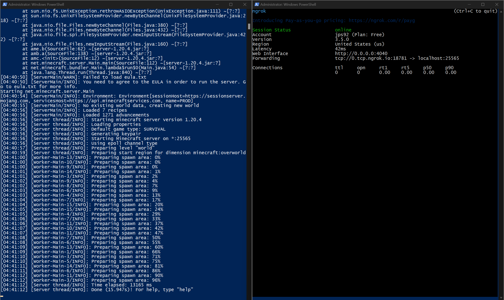

# **Mingrok - IT 610 Project**

Mingrok is a project built for IT 610 (Systems Administration) that allows anyone to host their own Minecraft server as a TCP service running on port 25565 and create a secure tunnel to that TCP service using ngrok, which eliminates the need for the server host to be either on the same LAN as others or to have to configure port forwarding on their router in order for others to connect to their server. The way this works is that once the Minecraft server is running on port 25565 as a TCP service, ngrok can then create a secure tunnel to the localhost of the machine running the Minecraft server and, by doing so, provide a public ngrok forwarding URL that forwards all traffic on that URL back to the localhost of the machine running Minecraft, allowing for external connections. In the [Single Container (midterm)](#single-container-midterm) section, the Minecraft server and ngrok are both packaged in a single Docker image and can be run using a single Docker container. In the [Multi-Container (final)](#multi-container-final) section, the Minecraft server and ngrok are packaged in separate Docker images and are run in separate Docker containers using Docker Compose.

> [!NOTE]
> This project and its contents are based on running Docker Desktop in a Windows environment.

## Requirements

- **Git** installed. ([Install](https://git-scm.com/download/win))
- **Docker Desktop** installed. ([Install](https://docs.docker.com/desktop/install/windows-install/))
- **ngrok** account. ([Sign up](https://dashboard.ngrok.com/signup))
- **Minecraft: Java Edition** purchased and installed. ([Purchase](https://www.minecraft.net/en-us/store/minecraft-java-bedrock-edition-pc)) ([Install](https://www.minecraft.net/en-us/download))

> [!NOTE]
> Purchasing and installing Minecraft: Java Edition is *optional* and only necessary for testing purposes.

## Build

### Single Container (midterm)

1. Ensure that Docker Desktop is running.
2. Open a Windows PowerShell terminal.

> [!IMPORTANT]
> Make sure to **Run as administrator**.

3. Change to your desired directory to download the files for this project with the following command:
```
cd "C:\path\to\your\directory"
```

> [!IMPORTANT]
> Make sure you are in a directory that you have write permissions for (e.g. **C:\Users\\\<Username>**, where **\<Username>** is your Windows username.)

4. Clone this GitHub repository to the working directory of your local machine with the following command:
```
git clone https://github.com/thejps92/it610.git
```

5. Move into the **it610** folder and then the **midterm** folder with the following command:
```
cd it610/midterm
```

6. Run the **docker.ps1** PowerShell script to build the Docker image for this project as well as create and run a Docker container based on that image with the following command:
```
Set-ExecutionPolicy Bypass -Scope Process -Force; .\docker.ps1
```

7. The Minecraft server should now be starting in the left tmux terminal pane, and in the right tmux terminal pane, it will prompt you to enter your ngrok authtoken, which can be found [here](https://dashboard.ngrok.com/get-started/your-authtoken). Copy and paste your ngrok authtoken into the terminal and hit `Enter`. If done correctly, your tmux terminal session should look similar to the [Single Container (midterm) Preview](#previews).

> [!NOTE]
> If you need to select a specific tmux terminal pane, use the shortcut `Ctrl`+`B` and then use the &larr; key to select the left tmux terminal pane and the &rarr; key to select the right tmux terminal pane.

8. In the right tmux terminal pane, you should see your ngrok terminal interface, and there will be a forwarding URL that looks similar to **1.tcp.ngrok.io:12345**. This is the URL users will enter into the **Server Address** bar in Minecraft in order to connect to your Minecraft server.

> [!NOTE]
> If you wish to access the ngrok web interface, open a web browser on the host machine running the Docker container and type the following in the address bar: **http://127.0.0.1:4040**

> [!WARNING]
> When attempting to connect to the Minecraft server using the ngrok forwarding URL, there is a possibility that it will fail, saying **Can't connect to server**. This is likely due to your network DNS server being unable to resolve the ngrok forwarding URL to its IP address. If you encounter this issue, you will have to change your network DNS server settings to use Google Public DNS, which seems to resolve this issue. The steps to do this can be found [here](https://developers.google.com/speed/public-dns/docs/using#windows).

### Multi-Container (final)

1. Ensure that Docker Desktop is running.
2. Open a Windows PowerShell terminal.

> [!IMPORTANT]
> Make sure to **Run as administrator**.

3. Change to your desired directory to download the files for this project with the following command:
```
cd "C:\path\to\your\directory"
```

> [!IMPORTANT]
> Make sure you are in a directory that you have write permissions for (e.g. **C:\Users\\\<Username>**, where **\<Username>** is your Windows username.)

4. Clone this GitHub repository to the working directory of your local machine with the following command:
```
git clone https://github.com/thejps92/it610.git
```

5. Move into the **it610** folder and then the **final** folder with the following command:
```
cd it610/final
```
6. Run the **compose.ps1** PowerShell script to build the Docker images for this project as well as create and run the Docker containers based on those images using Docker Compose with the following command:
```
Set-ExecutionPolicy Bypass -Scope Process -Force; .\compose.ps1
```

7. Two PowerShell windows should have launched and in one, it will prompt you to enter your Minecraft version, which can be found in the Minecraft Launcher. Type it into the terminal and hit `Enter`. In the other PowerShell window it will prompt you to enter your ngrok authtoken, which can be found [here](https://dashboard.ngrok.com/get-started/your-authtoken). Copy and paste your ngrok authtoken into the terminal and hit `Enter`. If done correctly, your two PowerShell windows should look similar to the [Multi-Container (final) Preview](#previews).

8. In the ngrok PowerShell window, you should see your ngrok terminal interface, and there will be a forwarding URL that looks similar to **1.tcp.ngrok.io:12345**. This is the URL users will enter into the **Server Address** bar in Minecraft in order to connect to your Minecraft server.

> [!NOTE]
> Unfortunately, under this configuration you will not be able to use the ngrok web interface.

> [!WARNING]
> When attempting to connect to the Minecraft server using the ngrok forwarding URL, there is a possibility that it will fail, saying **Can't connect to server**. This is likely due to your network DNS server being unable to resolve the ngrok forwarding URL to its IP address. If you encounter this issue, you will have to change your network DNS server settings to use Google Public DNS, which seems to resolve this issue. The steps to do this can be found [here](https://developers.google.com/speed/public-dns/docs/using#windows).

## Previews

1. Single Container (midterm) Preview


2. Multi-Container (final) Preview



## Disclaimers

- Building this project using the **Single Container (midterm)** section will download the server.jar file for the lastest version of Minecraft. Building this project using the **Multi-Container (final)** section will allow you to specify your Minecraft version so that it downloads the server.jar file associated with that version.
- Every time you start and stop ngrok, you will be given a new ngrok forwarding URL. This is by design and due to being on a free subscription account. If you wish to obtain a permanent TCP address from ngrok, which will always be used for your ngrok forwarding URL, you must upgrade your subscription. More information can be found [here](https://ngrok.com/docs/tcp/#tcp-addresses).